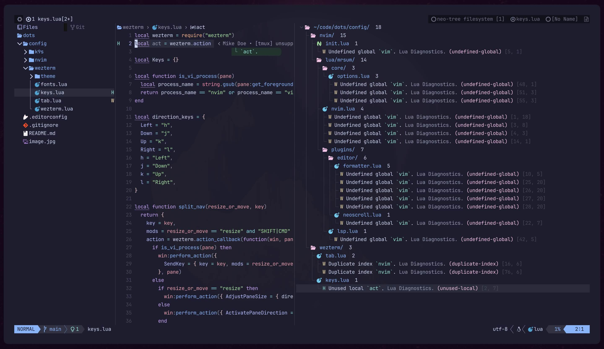

# Dotfiles



#### Keymaps:

```lua
local normal_mode = {
  mode = { "n" },

  -- neotree
  { "<C-e>", "<cmd>Neotree toggle<cr>", desc = "Neotree toggle" },

  -- global keys
  { "<CR>", "<cmd>noh<cr><cr>", desc = "Clear highlights" },
  { "<C-c>", "<cmd> %y+ <CR>", desc = "Copy whole file" },
  { "<C-s>", "<cmd>:w<cr>", desc = "Save file" },
  { "<C-q>", "<cmd>:q!<cr>", desc = "Quit" },
  { "<C-a>", "ggVG", desc = "Select all" },
  { "qq", "<cmd>:q!<cr>", desc = "Exit without savings" },

  -- fzf
  { "<S-P>", "<cmd>FzfLua files<cr>", desc = "Pick file" },
  { "<S-F>", "<cmd>FzfLua live_grep<cr>", desc = "Grep string" },
  { "<S-R>", "<cmd>FzfLua blines<cr>", desc = "Grep string in file" },
  { "<S-L>", "<cmd>FzfLua lsp_references<cr>", desc = "LSP references" },
  { "<S-Q>", "<cmd>FzfLua lsp_quickfix<cr>", desc = "LSP quickfix" },

  -- lsp
  { ".", "<cmd>Lspsaga finder<cr>", desc = "LSP finder" },
  { "<S-O>", "<cmd>Lspsaga outline<cr>", desc = "LSP Outline" },
  { "<S-K>", "<cmd>Lspsaga hover_doc<cr>", desc = "LSP hover doc" },
  { "<S-D>", "<cmd>Trouble diagnostics toggle<cr>", desc = "LSP diagnostics" },

  -- splits
  { "<S-V>", "<cmd>vs<cr>", desc = "Vertical split" },
  { "<S-H>", "<cmd>sp<cr>", desc = "Horizontal split" },

  -- split.navigation
  { "<S-Up>", "<cmd>SmartCursorMoveUp<cr>", desc = "Go to upper split" },
  { "<S-Down>", "<cmd>SmartCursorMoveDown<cr>", desc = "Go to down split" },
  { "<S-Right>", "<cmd>SmartCursorMoveRight<cr>", desc = "Go to right split" },
  { "<S-Left>", "<cmd>SmartCursorMoveLeft<cr>", desc = "Go to left split" },

  -- tabs
  { "<C-t>", "<cmd>$tabnew<cr>", desc = "New tab" },
  { "<C-w>", "<cmd>tabclose<cr>", desc = "Close tab" },
  { "<Tab>", "<cmd>tabn<cr>", desc = "Next tab" },
  { "<S-Tab>", "<cmd>tabp<cr>", desc = "Prev tab" },

  -- git
  { "<C-g>", "<cmd>Neogit<cr>", desc = "Open Neogit" },
  { "<S-S>", "<cmd>FzfLua git_status<cr>", desc = "Git status" },
  { "<S-B>", "<cmd>FzfLua git_branches<cr>", desc = "Git branches" },
  { "<S-C>", "<cmd>FzfLua git_commits<cr>", desc = "Git commits" },
  { "<C-d>", "<cmd>DiffviewOpen<cr>", desc = "DiffView" },
}

local insert_mode = {
  mode = { "i" },

  -- cursor moving
  { "<C-b>", "<ESC>^i", desc = "Beginning of line" },
  { "<C-e>", "<End>", desc = "End of line" },

  -- misc
  { "<C-s>", "<esc> :w<cr>", desc = "Save file" },
}

local visual_mode = {
  mode = { "v" },

  --
  { "<", "<gv", desc = "Move left" },
  { ">", ">gv", desc = "Move right" },
}
```

#### Install:

```bash
# mac os homebrew packages
- brew install fzf 
- brew install nvim
- brew install tmux
- brew install wezterm 

# tmux plugin manager
- $ git clone https://github.com/tmux-plugins/tpm ~/.tmux/plugins/tpm
```

#### LSP / Linters / Formatters
```bash
nvim
:Mason install eslint prettier stylua ...
```

#### Create symlink

```bash
ln -s ~/path/to/repo/config ~/.config
```

#### Commands:

tmux:

```bash
# keys
# ctrl+a - leader keys

<leader> c    - create new tab
<leader> 0-9  - switch to tab
<leader> |    - split vertical
<leader> "    - split horizontal

# switch to windows
<leader> Up
<leader> Down
<leader> Right
<leader> Left
```