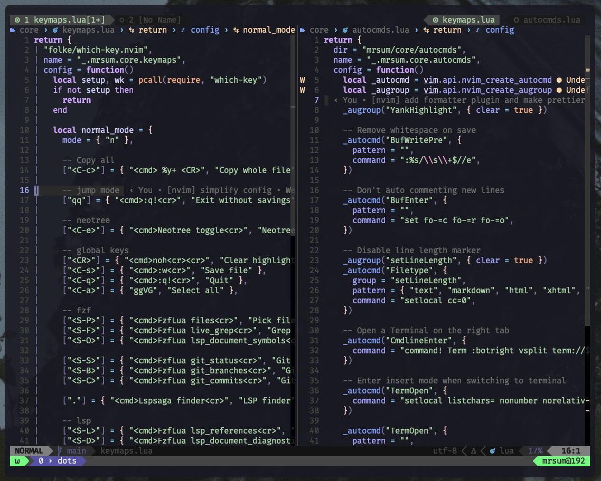

# Dotfiles



#### Requirments:

```bash
NVIM v0.10.0-*
```

For [installation check](https://github.com/neovim/neovim/wiki/Installing-Neovim#macos--os-x)

#### Install:

```bash
# mac os homebrew packages
- brew install nvim
- brew install tmux
- brew install alacritty

# tmux plugin manager
- $ git clone https://github.com/tmux-plugins/tpm ~/.tmux/plugins/tpm
```

#### Copy:

```bash
cp -r ./config ~/.config
```

Or create symlink

```bash
ln -s ~/path/to/repo/config ~/.config
```

#### Commands:

tmux:

```bash
# keys
# ctrl+a - leader keys

<leader> c    - create new tab
<leader> 0-9  - switch to tab
<leader> |    - split vertical
<leader> "    - split horizontal

# switch to windows
<leader> Up
<leader> Down
<leader> Right
<leader> Left
```

#### Run:

```bash
nvim

```